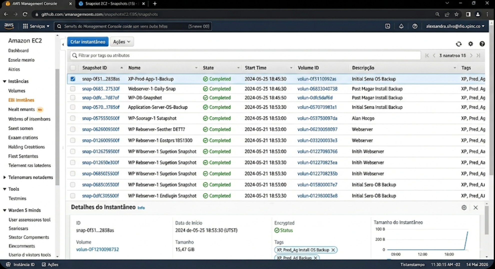

# Gerenciando Instâncias EC2 na AWS 🚀

Repositório criado para documentar o desafio prático de gerenciamento de infraestrutura na AWS, realizado através da plataforma [DIO](https://www.dio.me/). O foco deste laboratório é a administração de instâncias EC2, com ênfase em persistência de dados e automação via AMIs e Snapshots.

## 📋 Objetivos do Projeto
- Configurar e lançar instâncias EC2 com segurança.
- Gerenciar volumes EBS e criar Snapshots para recuperação de desastres.
- Desenvolver scripts de automação para backup de volumes.
- Criar AMIs customizadas para padronização de ambientes.

## 🛠️ Tecnologias Utilizadas
- **Cloud:** AWS (EC2, EBS, IAM)
- **Linguagem:** Python 3.x (Boto3)
- **Infra:** Linux (Bash)
- **Documentação:** Markdown

## 📂 Estrutura do Repositório
- `/images`: Evidências visuais da execução no console AWS.
- `/scripts`: Automação em Python e scripts de User Data.
- `README.md`: Documentação completa do projeto.

## ⚙️ Automação e Backup
Para este projeto, foi desenvolvido um script em Python (`scripts/manage_ec2.py`) que utiliza a biblioteca **Boto3** para identificar instâncias por meio de tags e gerar Snapshots automáticos de seus volumes. Essa prática reforça a resiliência da infraestrutura e facilita estratégias de *Disaster Recovery*.

## 📸 Evidências do Laboratório
Abaixo, a captura de tela do console AWS demonstrando a lista de Snapshots gerados com sucesso durante a prática:

## 📖 Insights Técnicos
1. **Snapshots Incrementais:** O EBS armazena apenas os blocos alterados após o primeiro snapshot, otimizando custos e tempo de armazenamento.
2. **Segurança (Cybersecurity):** A implementação de políticas de backup consistentes e a restrição de Security Groups (Princípio do Menor Privilégio) são camadas críticas para a proteção de dados na nuvem.
3. **Escalabilidade:** O uso de AMIs permite o provisionamento rápido de novas instâncias idênticas em caso de picos de demanda ou falhas de hardware.

---
Desenvolvido por **Maike Simoncini da Silva** como parte do portfólio de Cloud.
